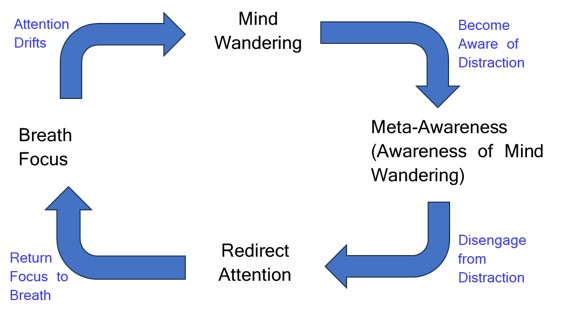

# Vipassana-TS2: Thoughtseeds Framework Implementation

This repository contains the reference implementation of the **Thoughtseeds Framework** for modeling Vipassana meditation dynamics.

This is a stochastic simulation using coupled Ornstein–Uhlenbeck dynamics as an initial Active Inference formulation, serving as a scaffold for future full Active Inference implementations. It is a computational simulation and does not do emprical data fitting or neuromimaging data analysis.

**Figure 1. Mediative Cycle**


## Conceptual Overview

**Figure 2. Conceptual Architecture**


- Level 1: attentional networks (DMN, VAN, DAN, FPN)
- Level 2: thoughtseed dynamics (competing content-level activations)
- Level 3: meta-cognition (precision modulation and policy switching)

The model minimizes Variational Free Energy (VFE) through perception–action–learning cycles and captures qualitative expert–novice differences via parameterized priors and precision settings.

## Detailed Algorithm & Framework

### 2.1 High-Level Conceptual Architecture
Drawing on Active Inference (Friston et al., 2017) and Global Neuronal Workspace Theory (Mashour et al., 2020; Dehaene and Changeux, 2011), the thoughtseeds framework is organized into a three-level hierarchy representing the functional mapping of meditative cognition. See **Figure 2**.

**Layer 1: High-Dimensional Brain Networks**: This foundational substrate represents the self-organization of neuronal packets into functional superordinate ensembles (Yufik 2019; Ramstead et a1. 2021). It provides the high-dimensional dynamical context for the model, instantiated via four representative attentional networks (DMN, VAN, DAN, FPN) (Yeo et al., 2011) selected for neurobiological grounding and model tractability.

**Layer 2: Low-Dimensional Thoughtseeds Network**: Functioning as a low-dimensional bottleneck that aligns with the serial processing constraints of 'System 2' (Kahneman, 2011) and the Global Neuronal Workspace (Mashour et al., 2020), this layer represents the competitive arena of conscious processing. Learned, low-dimensional latent variables, conceptualized here as ‘thoughtseeds’—analogous to the 'Consciousness Prior' (Bengio, 2017) sparse factor graphs —nucleate from Level 1 dynamics through a process of coarse-graining of nested Markov Blankets. The dominant thoughtseed is the emergent winner of this competition, achieving agentic causation by exerting top-down constraints that stabilize high-dimensional neural trajectories into coherent attractor states.

**Layer 3: Meta-Cognition**: Monitors agent-level policies on meditative states (BF, MW, MA, RA) (see **Figure 1**) and regulates Level 2 dynamics by modulating precision weighting and meta-awareness. This layer functions as the system's "irreducible Markov Blanket" (Ramstead et al., 2023), gating the information bottleneck to align dominant thoughtseeds with meditative goals, providing the top-down gain control necessary for sustained attention and distraction recovery.

**Information flow and Agentic System Interface**: The architecture utilizes a bidirectional flow: bottom-up influence and prediction errors (red) ascend the hierarchy to update internal beliefs, while top-down modulations and predictions (blue) descend to constrain lower-level dynamics. The internal states are insulated by a Markov Blanket that interfaces with the Umwelt (external environment) through sensory states (inputs) and active states (outputs) the agent engages with its world, aligning with principles of embodied cognition (Varela et al., 2017).

### 2.2 Implementation Scope and Simulation Strategy
The current implementation serves as an initial computational scaffold rather than a full, end-to-end Active Inference implementation. While the mathematical logic is derived from Variational Free Energy minimization and Active Inference-inspired principles, the simulation employs statistical learning rules and mechanisms and stochastic dynamical Ornstein Uhlenbeck processes to approximate the phenomenology of meditation.

Current implementation constraints include:
1.  **Layer 3 policies** (e.g., redirecting attention) exert direct influence on Layer 1 network activations. Ideally, the metacognitive agent should ideally only have access to the latent low-dimensional variables in Layer 2 (thoughtseeds), influencing the substrate solely through descending hierarchical predictions.
2.  The model relies on an extensive configuration suite for manual tuning of parameters such as mean-reversion rates ($\kappa$), noise levels ($\sigma$), selection precision ($\beta$), multiple network configurations and thoughtseed-network mappings across novice and expert profiles. This allows for precise "computational phenomenology"—mapping specific parameters to subjective meditative experiences—but differs from models where such parameters are purely emergent or learned.

### 2.3 Mathematical Model of Attentional Transitions
The model formalizes the meditative cycle as a stochastic dynamical system where transitions are governed by the minimization of Variational Free Energy (VFE).

#### Layer 1: Brain Network Dynamics
At the foundational level, activation $n_k$ for each of the four networks (DMN, VAN, DAN, FPN) is modeled via a stochastic Ornstein–Uhlenbeck (OU) process:

$$
dn_k = \kappa_N\big(N_k^*(t) + C_k(N) - n_k\big)\,dt + \sigma_N\,dW_k \\tag{1}
$$

where $\kappa_N$ represents mean-reversion (plasticity), $\sigma_N$ is intrinsic noise, and $C_k(N)$ encodes biologically motivated interactions such as DMN–DAN anticorrelation (Fox et al., 2015) and VAN-triggered salience (Seeley et al., 2007). The target activation $N_k^*(t)$ integrates bottom-up thoughtseed drive with top-down expectations: $N_k^*(t) = \sum W_{ik} z_i(t) + \alpha \mu_k(s_t)$, mapping high-level meditative states (BF, MW, MA, RA) (See **Figure 1**) to their neural manifestations.

#### Layer 2: Thoughtseed Dynamics
Thoughtseeds ($z_i$) (e.g., *attend_breath*, *pending_tasks*, *pain_discomfort*, *self_reflection*, *equanimity*) are low-dimensional latent variables derived via coarse-graining of the Layer 1 substrate. They function as a predictive "consciousness prior" (Bengio, 2017) that achieves agentic causation by stabilizing high-dimensional neural trajectories. Their evolution follows state-dependent dynamics:

$$
dz_i = \theta_z(s_t)\big[(\mu_i(s_t) + \mathcal{M}_{net,i}(N)) - z_i\big]\,dt + \sigma_z(s_t)\,dW_i \\tag{2}
$$

where $\mu_i$ are state targets, $\mathcal{M}_{net,i}$ is the modulatory bias from current network activations, and $\theta_z, \sigma_z$ vary with the phenomenological state (e.g., increased persistence during sustained focus).

#### Layer 3: Metacognitive Regulation and VFE
The agent minimizes a VFE objective ($F_t$) that balances sensory accuracy against model parsimony:

$$
F_t = \pi_{sens} L_{acc} + \pi_{prior} D_{KL}(Q(s)\parallel P(s)) \\tag{3}
$$

Here, $L_{acc}$ is the sensory negative log-likelihood (detecting mismatch between expected and actual mental content), and $D_{KL}$ is the Kulback-Leibler divergence from the meditative goal distribution. Precision terms are dynamically modulated by meta-awareness $M(t)$:

$$
\pi_{prior}(t) = (1 + \gamma M(t))(1 + \delta(F_{trend}))\,\lambda \\tag{4}
$$

where $\gamma$ captures metacognitive efficacy and $\lambda$ is a complexity regularizer (Dahl et al., 2015).

#### Policy Selection and State Transitions
To detect policy failure (e.g., mind-wandering), the model utilizes a leaky VFE accumulator, $A_t$:

$$
A_t = \rho A_{t-1} + \alpha F_t \\tag{5}
$$

A transition is triggered when $A_t$ exceeds an experience-dependent threshold $\theta_{crit}$. Upon triggering, candidate next states $k$ are scored by a fused similarity metric (Eq. 6) and sampled via a softmax selection (Eq. 7):

$$
S_k = \exp\!\left(-\frac{1}{\tau}\left(\lVert N_t - N^{\text{expect}}_k \rVert + \lVert z_t - \mu_k \rVert\right)\right) \\tag{6}
$$

$$
P(s_{t+1}=s_k)=\frac{S_k}{\sum_j S_j} \\tag{7}
$$

This sampling scheme integrates both network-level evidence and content-level priors to select the state (BF, MW, MA, RA) with the highest "affordance" or fitness relative to the current landscape (Friston et al., 2017).

## Project Structure (key files)

- **`meditation_model.py`**: core agent implementation (`AgentConfig`, `ActInfAgent`) — dynamics, inference, and small learning updates.
- **`meditation_trainer.py`**: `Trainer` class that orchestrates experiment runs (extracted from the agent for testability and CI).
- **`meditation_utils.py`**: I/O helpers, `ou_update`, JSON serialization, and aggregate computations.
- **`meditation_config.py`**: parameter profiles, `DEFAULTS` for central numeric constants.
- **`run_simulation.py`**: high-level entrypoint; uses `Trainer.train()` and supports reproducible runs (seed + output_dir).
- **`viz/`**: plotting scripts (`plot_attractors.py`, `plot_diagnostics.py`, `plot_convergence.py`) and plotting utilities.
- **`data/`**, **`plots/`**: generated JSON outputs and figures.

```
## Reproducibility & Outputs

- The `Trainer.train()` method accepts optional `seed` (sets NumPy RNG) and `output_dir` (path for JSON outputs).
- Default numeric constants and thresholds are centralized in `meditation_config.DEFAULTS` for maintainability.
- JSON outputs include `transition_stats_<level>.json`, `thoughtseed_params_<level>.json`, and `active_inference_params_<level>.json`.
 - Random number seed is set to 42 by default.

## Useful Commands

```bash
# run full simulation
python run_simulation.py

# regenerate plots
python -m viz.plot_convergence
python -m viz.plot_attractors
python -m viz.plot_diagnostics
